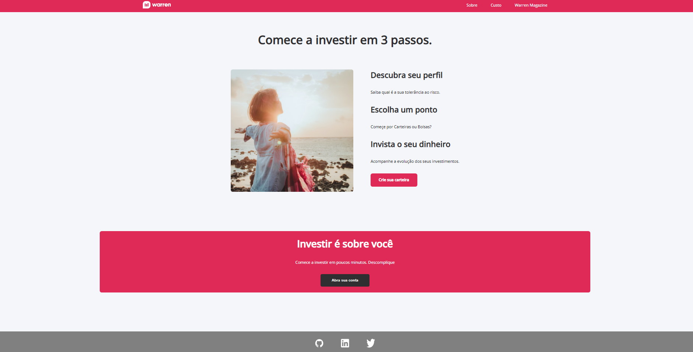

<h1>[PROJECT IN PROGRESS...]</h1>

The objective of this project is to create a simple responsive landing page for the company Warren Brasil

 

<h2>This is the main page</h2>

 

  

URL Project: <a> https://marvelous-boba-139de6.netlify.app </a>

 

<h2>About Warren Tech Academy</h2>

<h4>
Warren Tech Academy is a developer training program that aims to create new talent for the programming world. This program was created by the company Warren Brasil, one of the largest investment brokers in Brazil
</h4>